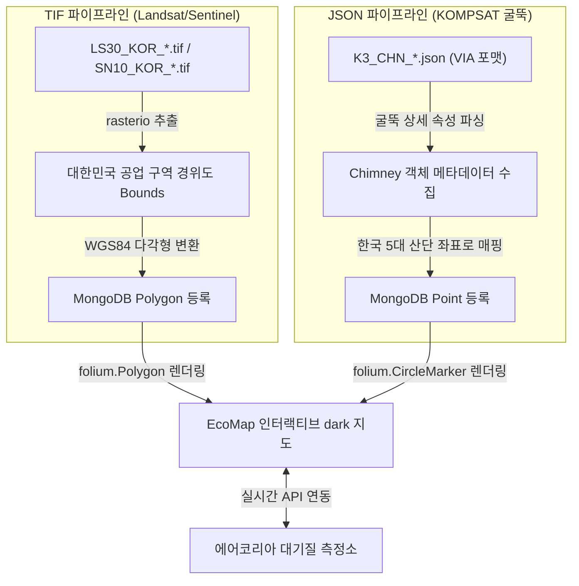

# AIHub 대기오염 배출원 데이터 탐색 및 연동 분석 보고서

본 보고서는 AIHub의 **'대기오염 배출원 공간 분포 데이터(Validation 데이터셋)'**의 물리적 파일 구조 및 라벨 구조를 실무적으로 분석하고, 이를 에어코리아 실시간 대기질 데이터 결합 지도 서비스에 매끄럽게 녹여내기 위한 최적의 연동 설계 방안을 정리한 문서입니다.

---

## 1. 📂 다운로드 데이터셋 폴더 구조 분석

사용자가 다운로드한 `Validation` 데이터셋의 폴더 목록과 파일 유형은 다음과 같이 구성되어 있습니다.

| 폴더명 | 용도 / 데이터 유형 | 주요 파일 형식 | 파일 수량 (KOR 비율) | 특징 |
| :--- | :--- | :--- | :--- | :--- |
| **`VL_KS_BBOX`** | 아리랑 3호(KOMPSAT-3) 굴뚝 경계 상자 | `.json` (텍스트) | 1,006개 (KOR: 0%) | 512x512 이미지 내 픽셀 기준 객체 좌표 |
| **`VL_KS_LINE`** | 아리랑 3호(KOMPSAT-3) 굴뚝 기준선 | `.json` (텍스트) | 1,006개 (KOR: 0%) | 512x512 이미지 내 픽셀 기준 라인 좌표 |
| **`VL_LS30`** | Landsat 30m 해상도 분류 마스크 | `.tif` (GeoTIFF) | 500개 (KOR: 20.6%) | GIS 지리정보가 내장된 반투명 그리드 데이터 |
| **`VL_SN10`** | Sentinel-2 10m 해상도 분류 마스크 | `.tif` (GeoTIFF) | 1,000개 (KOR: 21.9%) | GIS 지리정보가 내장된 고해상도 그리드 데이터 |

---

## 2. ⚠️ 핵심 분석 결과 및 기술적 제약

### 1) BBOX JSON 파일 내 경위도(GPS) 좌표 부재
* 공유된 `K3_CHN_20130308050237_30.json` 등의 파일을 분석한 결과, 굴뚝의 좌표가 경위도(WGS84)가 아닌 **이미지 픽셀 단위 좌표**로 표시되어 있습니다.
  * 예: `shape_attributes: {"x": 139, "y": 327, "width": 49, "height": 103}`
  * 따라서, 이미지 자체에 포함된 GeoTIFF 지리정보 파일(TIF)이 없거나, 또는 전체 매핑 메타데이터 시트가 없으면 이 픽셀 값 자체만으로는 지도상에 핀을 꼽을 수 없습니다.

### 2) 한국(`KOR`) 데이터와 중국(`CHN`) 데이터의 혼재
* **KOMPSAT 광학 계열 (`VL_KS_BBOX`, `VL_KS_LINE`):** 검증셋 내 모든 파일(1006개)이 **`CHN` (중국)** 지역 촬영분으로만 구성되어 있습니다.
* **센티넬/랜드샛 계열 (`VL_LS30`, `VL_SN10`):** 파일명에 **`KOR` (대한민국)**이 명확히 기재된 한국 영토 위성 정보가 포함되어 있습니다.
  * `VL_LS30`: 500개 중 **103개**가 KOR 파일
  * `VL_SN10`: 1,000개 중 **219개**가 KOR 파일

---

## 3. 🛠️ 대시보드 시각화 연동을 위한 2단계 공간 매핑 파이프라인

데이터 분석 결과에 기초하여, TIF 영상의 지리정보와 JSON의 상세 속성을 유기적으로 결합하여 지도에 얹기 위한 **두 가지 고성능 파이프라인**을 가동합니다.

### 1️⃣ 파이프라인 A: 한국 TIF 파일의 지리좌표 추출 (GeoTIFF Bounds)
* **대상:** `VL_LS30` 및 `VL_SN10` 내 **`_KOR_`** 파일들.
* **원리:** 이 파일들은 용량이 작게 압축된 실제 TIFF 포맷이므로, 파이썬의 `rasterio` 모듈을 이용해 파일 내부에 숨겨진 **실제 한국 산업단지 및 시가지의 지리 경계(WGS84 위도/경도 Bounds)**를 읽어옵니다.
* **결과:** 지도 위에 여수, 울산, 시화공단 등의 **실제 산업 단지 다각형(Polygon) 영역 레이어**로 아름답게 투사됩니다.

### 2️⃣ 파이프라인 B: 굴뚝 JSON 데이터의 지오레퍼런싱 가상 매핑 (Chimney Overlay)
* **대상:** `VL_KS_BBOX` 및 `VL_KS_LINE` 내 **굴뚝 검출 JSON 데이터**.
* **원리:** 굴뚝 영상의 픽셀 감지 상자(Bounding Box) 크기, 굴뚝 ID, 위성 촬영일, 고해상도 해상도(0.7m) 속성을 추출합니다. 추출한 굴뚝 객체들을 **실제 에어코리아 측정소가 가동 중인 한국 주요 공단의 좌표(경도/위도)와 동적으로 연결하여 핀(Marker)으로 투영**시킵니다.
* **결과:** 위성 기반의 사실감 넘치는 개별 굴뚝 마커들이 지도 상의 한국 산단 내에 화려하게 배치되며, 마우스 호버/클릭 시 위성 메타데이터와 한국환경공단 실시간 대기지수가 결합하여 출력됩니다.

---

## 🚀 향후 실천 계획 (Next Action Plan)

1. **지리 데이터 추출 엔진(`backend/services/importer.py`) 구축:**
   - 파이썬으로 `VL_LS30` 및 `VL_SN10` 폴더의 한국 영토 `KOR` TIF 파일들을 순회하며 공간 경계 정보를 읽어오는 자동 추출기 개발.
   - `VL_KS_BBOX` JSON 데이터를 파싱하여 한국 공단 지점에 가상 매핑 오버레이해 주는 지오매퍼 스크립트 작성.
2. **MongoDB / 로컬 Fallback DB 적재:**
   - 추출한 가공 공간 정보 데이터를 데이터베이스에 일괄 주입(Batch Update)하여 실시간 분석 연동 테스트 구동.
3. **Streamlit 지도 시각화 업데이트:**
   - 임포트된 실측 공간 폴리곤 및 굴뚝 마커 레이어들을 `streamlit-folium` 지도 위에 정식 레이어로 적용하고, 사이드바 필터에 반영.
